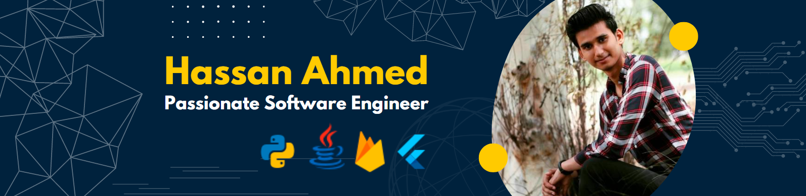

  
I'm a Undergraduate Software engineer working of Mobile Application Development

## 🌐 Socials:
   

# 💻 Tech Stack:
                  
# 📊 GitHub Stats:
 
 

## 🏆 GitHub Trophies

### ✍️ Random Dev Quote

### 🔝 Top Contributed Repo

---

<!-- Proudly created with GPRM ( https://gprm.itsvg.in ) -->
